# Introduction

SmartMenu is a set of Android Apps which help restaurants or food and beverage service businesses to manage their order flow.

This document will provide a summary introduction of the SmartMenu software and hardware components and configuration. 

Detailed instruction manuals for the individual apps will be be provided as separate documents. 

For the complete set of documents, visit: github.com/wickapps/smartmenu

SmartMenu is a work in progress. See the current to-do worklist at SmartMenu_Worklist.MD.

## Food & Beverage Digitization Trend

Restaurants or food & beverage operation digitization is currently at the early stages of a strong up-trend. SmartMenu can help businesses achieve their digitization goals.

According to the National Restaurant Association:

- Mobile app technology is fundamentally changing the food service industry. 
  - **46%** of consumers would use a smartphone app if available
  - **41%** would use a ordering terminal in the restaurant if available
  - **56%** of quick service restaurants (**40%** full service) say electronic ordering will become more popular.
- Consumers are hungry for technology options in restaurants
  - **23%** have placed orders on a tablet, **50%** would if available
  - **7%**% of customers have placed an order on a terminal in a restaurant, **50%** would if it was available
  - **6%** have paid for a meal with a smartphone, **24%** would if available

## SmartMenu Features

SmartMenu offers advantages for food and beverage operations which have not yet begun a digitization process. Some of the strengths of the SmartMenu system include:

- Increase Sales - Improved ordering process for customers can translate upwards to 30% or more in average customer orders.
- Decrease Expenses - Requires less staff to operate food & beverage service business. Digitization helps to improve operational efficiencies.
- Flexible and modular design of the software can allow businesses to tailor the solution for their operations.
- Improved Customer Service - No waiting for waiters; staff can focus on providing better customer service.
- Multi-Language - Because the SmartMenu system was developed originally in China, the support for multi-language ordered was designed in from day one.
- Analytics - Cloud-based data storage and reporting.
- Ease of Use - App-based intuitive User Interface. Pricing, menus, and daily specials can be revised in real time.
- Low Setup Costs - Affordable setup costs and equipment fees. The SmartMenu digital ordering system utilizes low-cost Android devices.

## SmartMenu Android Applications

SmartMenu consists of the following native Android Apps. At this time, SmartMenu does not support any native Apple iOS applications.

  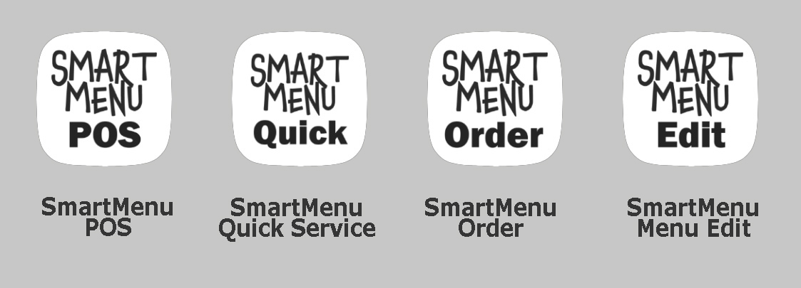

The SmartMenu apps can be mixed and matched to meet the needs of most restaurant service models, including, quick service, full service, and take out only service models.

> NOTE:
>
> There is an additional Mobile App called SmartMenu Mobile. This app is currently incomplete. Unlike the Android apps listed above, SmartMenu Mobile is not a native Android app. SmartMenu Mobile is a web-based app which can run on any JavaScript enabled browser, and is thus cross-platform. 
>
> If completed, the SmartMenu Mobile web app could be deployed to customers on any type of device, including laptop browsers and Apple iOS phones. The advantage of web-based apps is that they are cross-platform. the disadvantage is that they typically lag in performance and functionality.

## SmartMenu Server

In addition to the SmartMenu Android apps, SmartMenu includes a required server software component. SmartMenu is a cloud-based system and cannot function without the server component. The server can be hosted on the internet or privately within the restaurant premises.

The server software enables the following functionality:

- Centralized storage of menu assets
- Centralized storage of menu picture assets
- Centralized storage of order data
- Centralized storage of all configuration parameters. This allows new devices to be setup with minimal effort.
- Web based report generation.

The SmartMenu server software consists mainly of PHP scripts which allow for the management of menus, storage of dish pictures, storage of order data and configuration settings.

Because the scripts are written in PHP, it is recommended to use backend service architectures which use the LAMP architecture. LAMP stands for Linux, Apache, MySQL, and PHP. All of the major cloud hosting platforms offer low-cost LAMP servers, including:

- Amazon AWS
- Microsoft Azure
- Google Cloud Services
- Alibaba Cloud

and many, many others.  

# Restaurant Service Models

The first step in configuring SmartMenu is to decide which restaurant service model you are following. Some of the most common service models are listed below, along with a simple definition and some examples.

- Quick Service - Quick service restaurants (QSR) typically require customers to wait in a line to place their orders. Menus are displayed overhead and you place your order with the cashier when it is your turn for service. Payment is completed before the food is prepared. QSR restaurants typically use a marker system. Customers take the marker to a table and the food will be delivered to the table when it is completed. QSR restaurants do not maintain an open tab for individual tables.  Fast food is a sub-category of QSR, characterized by food preparation which is fast enough such that customers can carry their own food to the table rather than taking a marker for later delivery.
  Examples include: Chipotle, Panera Bread, McDonalds
- Full Service - Full Service Restaurants (FSR) typically employ a host or hostess who will seat guests at tables when they arrive. A tab is opened for the table, effective for the duration of the customer visit. FSR operations can range from casual to fine dining.
  Examples include: Chilis, Applebees, Texas Roadhouse,
- Food Truck Service - We are all familiar with the Food Truck. This model is a sub-category of the QSR service model. Customers queue at the truck service window, place their orders, complete payment, and then await for their order to be delivered.
  Examples are locally numerous, but also include some nationwide brands such as Cousins Maine Lobster
- Take Out Service - The Take Out Service model is typically implemented by restaurants who only offer Take Out orders and do not maintain inside customer seating. This model is popular with Pizza restaurants or some coffee chains. 
  Examples include: Dominos Pizza, Scooters Coffee, or fast food or coffee establishments with drive-thru operations such as Chic-Fi-La or Starbucks.
- Delivery Service - Some establishments employ a model which only uses delivery service to distribute orders. In this model, orders can originate from the internet, mobile devices, or the establishment's website. Such operations employ third party delivery services such as Uber Eats, Doordash, Grubhub, Deliveroo, etc, to delivery the order. In countries where labor is inexpensive it may be feasible for the establishment to manage their own delivery fleet. 

## SmartMenu Service Model Coverage

The SmartMenu apps are modular. The table below shows the SmartMenu Application combinations typically used to implement the common restaurant service models. Note that in each of the models, the Menu Edit App is used to configure and manage the menu.

|                    |    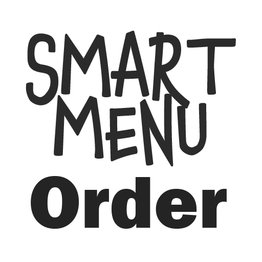    | 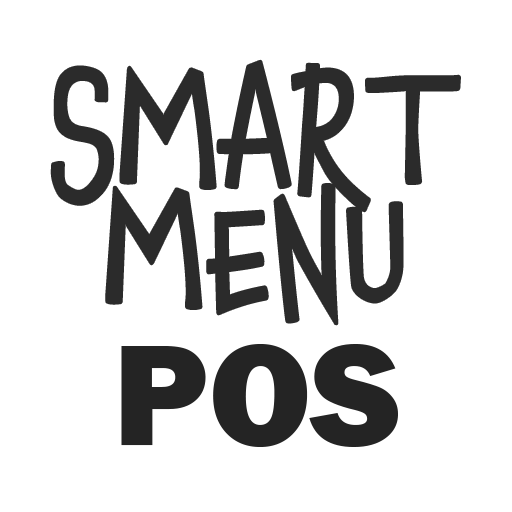 | 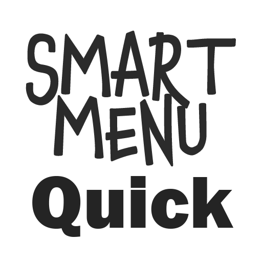 |  |
| ------------------ | :-----------------------------------------------: | :---------------------------------------: | :-----------------------------------------: | :----------------------------------------: |
| Quick Service      |  (line busting) |                                           |           |          |
| Full Service       |    (optional)   |         |                                             |          |
| Food Truck Service |    (optional)   |                                           |           |          |
| Take Out Service   |                                                   |                                           |           |          |
| Delivery Service   |  (wide mobile)  |                                           |           |          |

There is some flexibility in the way the apps can be combined. 

Let's take for example a food truck model. If we simply wanted to implement typical food truck order at the truck service window, we would only need to use the **MenuEdit** app to manage the menu, and the **Quick** app to take customer orders. However, if we wanted to allow customers at the truck to enter their own orders, we could add one or more instances of the **Order** app and allow customers to use the **Order** app on dedicated tablets instead of standing in the line. The **Order** apps will send completed orders to the **Quick** app.

The same optionality could apply to a FSR model. We could deploy tablets with the **Order** app to the tables to allow customers to submit their own orders without speaking to a waiter/waitress. In this example, the **Order** app instances communicate order data directly to the **POS** app which manages all the tables and open tabs.

# SmartMenu Software Summary

The following table shows a summary of the SmartMenu Android apps and Server software component. There are four commercial Android Apps, one incomplete Android App, and a server software component.

|     Software      |                    Platform                     |    Version    | Description                                                  |
| :---------------: | :---------------------------------------------: | :-----------: | ------------------------------------------------------------ |
|     Order App     |                     Android                     |     1.06      | Customers use the Ordering app in the restaurant to directly place orders |
|   Menu Edit App   |                     Android                     |     1.03      | The Menu Edit App allows managers to change and control all aspects of the menu |
|      POS App      |                     Android                     |     1.05      | Management uses the POS app to control all tables and open tabs |
| Quick Service App |                     Android                     |     1.00      | Quick Service app manages walk-in orders and can receive Telephone, Mobile, or Internet Orders |
|    Mobile App     |        JavaScript (Platform independent)        | Not Available | Customers can the Mobile app to place orders from their mobile devices remotely. |
|      Server       | LAMP Server (Linux/Apache/ MySQL/PHP) |      1.0      | The server software enables the benefits of a cloud-based architecture, including remote menu management, and remote data analytics management. |

## System Features

Some of the key system features of SmartMenu are highlighted below:

- The system is relatively easy to setup
- Ability to support most of the popular restaurant service models, including QSR and FSR
- Android based Apps are easy to deploy. Android apps can be "sideloaded" and do not require users to download official versions from any central app store.
- The system supports Multi-language. Current translations are available for English and Mandarin Chinese, but additional languages can be added.
- Cloud-based architecture is supported. And cloud server provider can be used as long as they can support the LAMP architecture.
- SmartMenu does not require internet connectivity to function. The system can work normally when no Internet connection is available. However, for cloud-based synchronization of menu and order data, a connection must be available for the data to be synchronized.
- Multiple restaurants can be supported by the platform. Each restaurant is identified by a unique SmartMenu ID.
- A restaurant  which has an existing website can be integrated with SmartMenu so that the current active menu is available for display on the website. 
- Order data is stored on the server in the cloud. The serves two useful purposes; 1) it is easy to access reports and analytic data from anywhere, 2) there is an added level of security because orders are immediately sent to the server, reducing the vulnerability of in-house data breaches.
- Remote crash logging is supported by all the SmartMenu apps so they can be easily debugged if crash or problems occur.
- SmartMenu uses low cost Android tablets and POS equip, minimizing the capex costs of the establishments.
- The SmartMenu applications are well tested, having sent over 500,000 orders in the past 5 years of operation.

## Application Features

In addition to the system level features, each of the Android apps and server software include useful features, including:

- Picture based menus help customers understand what each dish looks like, leading to higher sales.
- The system can support relatively complex menu and pricing structures, meaning that the menus of most food service businesses can be directly imported into the system.
- Real-time menu editing. After menu changes are made using the **Edit** App, menus are automatically downloaded to each device, so owners do not have to spend time reconfiguring each device when the menu is updated.
- The system supports Kitchen abbreviated codes, meaning that back of the house staff can read simple "shortcut" codes for each dish requested by the customers.
- The modular SmartMenu system supports most restaurant service models. Businesses can start with a few tablets and printers and expand to larger configurations as they grow.
- Optional discounts can be configured at the dish level.
- Optional modifiers can be configured at the dish level.
- Special instructions can be enabled at the dish level, enabling customers to include directions for each dish.
- Daily specials can be configured to display as separate entry page on the **Order** App.
- Customized restaurant logo and color schemes can be configured. This allows for branding within the customer-facing **Order** App.
- SmartMenu supports Activity logging. When managers perform keys functions, such as logging in, managing the cash drawer, or applying discounts to dishes, those activities are logged to the server with a time/date stamp so they can be monitored and tracked.
- The **POS** and **Quick** Apps support user management. Users can be defined with 3 priority levels. Functions can then be restricted to users based on their security level.
- SmartMenu uses a centralized ticket numbering system. When multiple modules are used to accept orders, such as the **Quick** Service App, the **POS** App, and the **Order** App, a unique sequential ticket number is managed by the server for each order.  
- SmartMenu supports register cash management, including register log in/log out, cash float, and reconciliation operations.
- Support for up to three POS printers and one cash drawer.

# Architecture Overview

The drawing below shows a typical SmartMenu configuration, utilizing all four of the SmartMenu apps, three POS printers, a cash drawer, and internet connection to the backend server.

  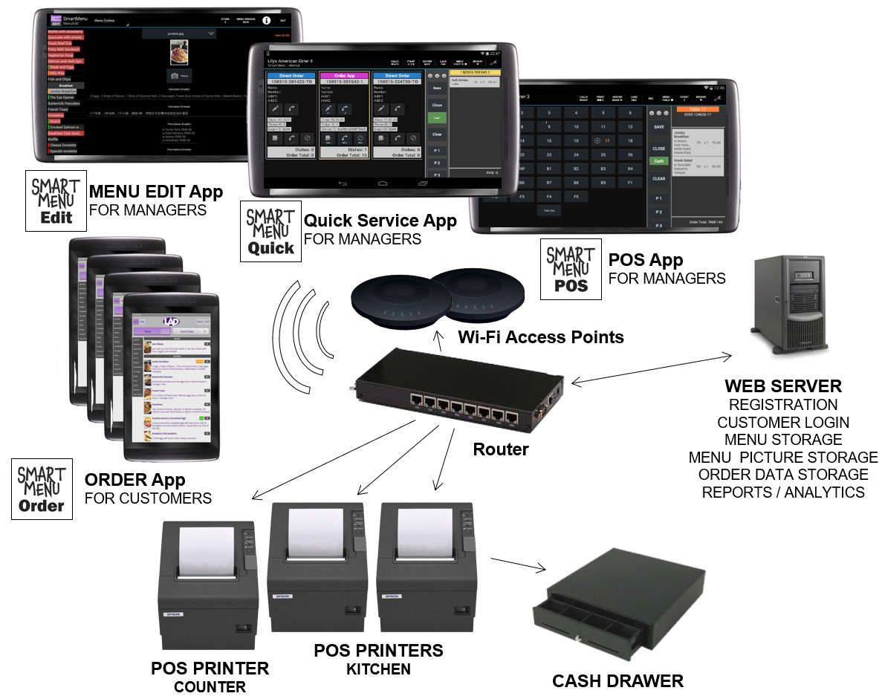

As shown, the **Order** App can be used directly by customers or by in-house wait staff, while the **Edit**, **Quick**, and **POS** Apps are exclusively used by managers or restaurant staff. 

Wi-Fi is required for connection to each of the devices. 

Wired Ethernet is required for connection to the POS printers.

Internet connection is required for access to the Server functions, although it is not required for operation of the system.

# Order App Overview

The **Order** App is used to display the menu and place orders. Depending on the configuration, it can send orders directly to a POS printer, or send them on to another app, such as the **POS** App or the **Quick** App where the order can be consolidated.

Highlights of the **Order** App:

- Android App runs on low-cost 7” cost tablets
- Tablets can be dedicated to tables, delivered to tables, or used by wait staff
- Restaurant branding can be preserved with logos and colors 
- Easily switchable between languages, English and a secondary language
- Settings and menus are downloaded automatically to all tablets
- Customers can place orders without the assistance of a waiter

## Order App Layout

The app uses a vertical portrait layout. This makes it well-suited for display on 7" Android tablets or mobile phones. The app could also run on larger 10" tablets in the portrait orientation.

The top section of the layout includes the business logo, and control buttons for language selection, messaging, miscellaneous business information, and the Exit function.

The main body of the layout consists of two tabs:

- *Menu Tab* shows a list of the menu, including the menu categories along the left side. Each of the dishes on the menu is shown in a List View format with a small thumbnail picture included at the left. A dish description is included, as well as pricing information, and some badges indicating, New, Popular, or Healthy dishes.
- *Send Order* tab shows the current list of selected items and allows the customer to send the order. The Send Order tab allows users to make changes to to their order list before sending the order. 

An example screenshot of the *Menu Tab* follows. This particular menu includes fifteen dish categories which are shown on the left.

  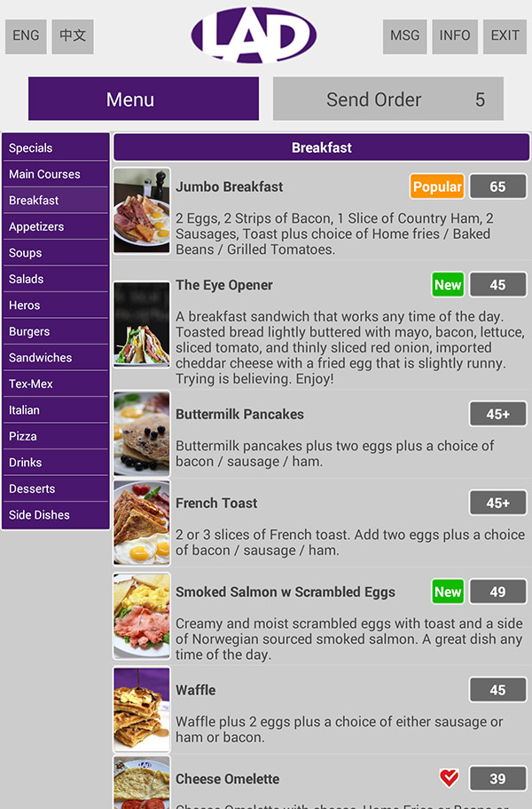

When a customer or wait staff presses on a dish, a detailed *Dish Options* screen is shown for that particular dish. This screen includes detailed pricing options and extra configuration choices. The user is also allowed to enter a special instruction, or a dish quantity if the would like more than one item.

The *Dish Options* screenshot is shown below. 

  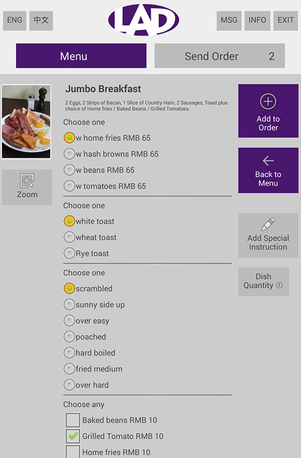

When a customer or wait staff presses the *Add to Order* button, the dish will be added to the order, along with all of the selected options, quantity and special instructions.

> Note: In these screenshots, the pricing numbers are shown in Chinese RMB currency. This format includes a single integer number without decimal point.

The second tab on the **Order** App layout is the *Send Order* tab. This tab shows the user the currently selected dishes on the order ticket. A screenshot is shown below.

  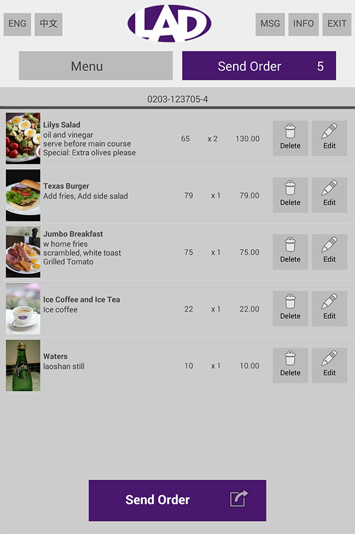

The Send Order tab allows the user to delete dishes, edit dishes, or send the order. At any time, uses can switch back and forth between then Menu tab and the Send Order tab to build their order ticket. 

## Order App Use Cases

There are a number of use cases for the SmartMenu **Order** App.

- Standalone mode:
  This is the most simple SmartMenu configuration. In this configuration, a single instance of the **Order** App can send orders to a single POS printer. In this mode, a single order taker can use the **Order** App to take customer orders directly. This is the most simple QSR service model with minimum cost to setup. It could be suitable for an operation with no kitchen, such as a small coffee/beverage shop.
- Direct customer use:
  Because there is no limit on the number of instances of the **Order** App which can be deployed, a FSR service model can be configured where low-cost tablets are provided at each seating table in a restaurant. In this mode, customers directly send their own orders. The orders are aggregated by the **POS** App. The **POS** App can automatically send orders to the kitchen, or require staff to approve the order before it proceeds.
- Waitstaff use:
  Similar to direct customer use, but in this mode, the wait staff use the **Order** App on their own dedicated devices to build orders while interacting with the customers. 
- Wide mobile device deployment:
  In this model, a white label version of the **Order** App can be built for the food service business and then deployed through the Google Android Play Store to the widest possible audience. Then customers of the business can download the app and use it on their own devices when they visit the food service business. 
- Narrow mobile device deployment:
  In this model, the food service business can control the distribution of the white label Order app and provide it to their customers for use on their own devices when they are on premise.
- Line-buster mode:
  The **Order** App can be used in conjunction with the **POS** or **Quick** App to serve as a "line busting" solution. Rather than have customers wait in a single line to speak with a person, this configuration can allow orders to be taken at multiple points by deploying ordering tablets at the front of the house or food truck.

# MenuEdit App Overview

Menu Edit App allows managers to control all aspects of the menu and the SmartMenu settings.

Highlights of the **MenuEdit** App:

- Supports menu versioning
- Multiple menus can be maintained for multiple restaurants branches
- The App can be run on any Android device, but it is best suited for 10” tablets running in the landscape orientation
- The App allows for real-time menu updates. When the a menu is updated, the changes are sent to the SmartMenu Server and then other deployed SmartMenu devices will automatically receive the updated menu.
- Picture based menus are supported. The **MenuEdit** App allows you to take food photographs directly from the device camera.
- The **MenuEdit** App can handle complex menu structures. It includes support for categories, dish descriptions, options, extras, translations, prices, and dish badges for popular, new and healthy dish markers.
- In addition to managing all of the menu aspects for SmartMenu, the **MenuEdit** App also allows managers to adjust any of the SmartMenu settings.

As a security measure. when starting the **MenuEdit** App, the app will require you to enter to enter two credentials before proceeding, the SmartMenu ID and the admin password. After successful entry, the **MenuEdit** main layout will be displayed.

## MenuEdit App Layout

The MenuEdit App layout contains a top panel menu bar and a working area below.

The menu bar contains a text box on the left side. Using a drop-down menu, users can select any of the following five configurations to edit:  

- Menu Dishes
- Menu Categories
- Dish Options
- Dish Extras
- SmartMenu Settings

The *Dish Options*, *Dish Extras*, and *Menu Categories* are high level entries which contain configurations that any dish can refer to. when creating a new menu, these musty be created first.

The *Menu Dish* entry is a lower level entry and is the most commonly used. This entry will contain all of the information for each dish on the menu.

The screenshot below shows the **MenuEdit** App displaying the *Menu Dish* entry for one of the dishes on the menu, in this case, the Jumbo Breakfast, which is highlighted in gray color on the left side.  

  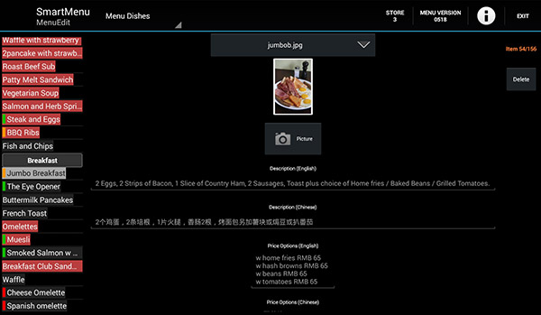

In addition to all of the details for specific menu items, the MenuEdit App also allows the user to mark certain dishes as *Unavailable*. Dishes marked as *Unavailable* are color-coded in inverse-red color, and can be seen in the screenshot on the left side. Dishes marked as *Unavailable* do not display on the other SmartMenu Apps. This is a useful feature for the restaurant owner if perhaps, during the course of daily operations, a certain dish becomes unavailable for any particular reason.  

Unlike the other SmartMenu Apps, the **MenuEdit** App requires internet connectivity. Without internet connection, the app will fail to initialize. This is because the master restaurant menu must be update to date on the server at all times so that it can be synchronized across the other SmartMenu Apps.

# POS App Overview

The **POS** App is the most sophisticated of the SmartMenu Apps. It allows management to control all aspects of the tables and open tabs at each table.

Highlights of the **POS** App:

- Designed for low cost 10” Android tablets
- Supports three user levels: Manager, staff, and waiter. Each of the users is able to access different functions. The manager level is the highest and has access to all functions.
- Allows complete access to the menu. Orders can be directly entered on the POS App.
- Allows connection to the **Quick** App and the **Order** App, such that orders can be forwarded from those devices to the **POS** App.
- Provides the ability to change tables, move tables, delete individual dishes, apply discounts to dishes 
- Supports multiple users. Users are able to log in and log out.
- Multi language support. Primary language is English. Translations are currently available to support Chinese as a secondary language. Other secondary languages could be included.
- Supports up to three POS printers. Typically one at the counter and one or two in the kitchen or bar area where food and beverage are prepared.
- Easily print a daily summary to reconcile the daily business.
- Closed tabs are sent automatically to the cloud for analytics and reporting.
- The **POS** App provided the ability to reload historical tabs from the cloud.
- Provides cash management and cash drawer support

## POS App Layout

The **POS** App has 4 layout areas, Top, Left, Middle, and Right. The Left, Middle, and right areas are scrollable, so they can extend beyond the bottom edge of the device screen. 

> Note:
>
> The terms *Table* and *Tab* can be used interchangeably when discussing the **POS** App. The term *Ticket* is used to describe an order within the **Quick** Service App.

Each of the layout areas has a distinct function as follows:

- Top Panel
  The top panel contains important information, including the restaurant name, SmartMenu ID, currently logged in staff member, status of the POS printers, and most importantly, a selector which toggles the left information panel between *Tables View* and *Menu View*.
- Left Information Panel
  The left information panel occupies the largest percentage of the device screen area, approximately 2/3 of the useable screen. It can contain either a *Table View* of the current table status or a concise *Menu View* of the complete current menu. The view is selected by pressing the toggle switch in the top panel.
- Middle Control Panel
  The middle control panel is a thin strip that includes several important controls related to management of open tickets/tabs associated with tables. Controls include, close a tab, save a tab, clear a tab, choose payment method, or print a tab out on any of the POS printers. The middle control panel also has status indicators for the POS printers at the top.
- Right Ticket Panel
  The right ticket panel displays information about the currently selected table, or ticket. While the tab is open, as customers continue to order additional items, they will accumulate on the specific table ticket. 

The image below shows the **POS** App with the *Table View* on the left information panel. A close look at the Top panel shows the *Menu/Table* toggle is set in the *Table* position.  

In this example, only table 17 has an open tab, as indicated by the "plus circle" indicator on the table button. The right ticket panel is currently displaying the current items (two items) assigned to this open tab.

  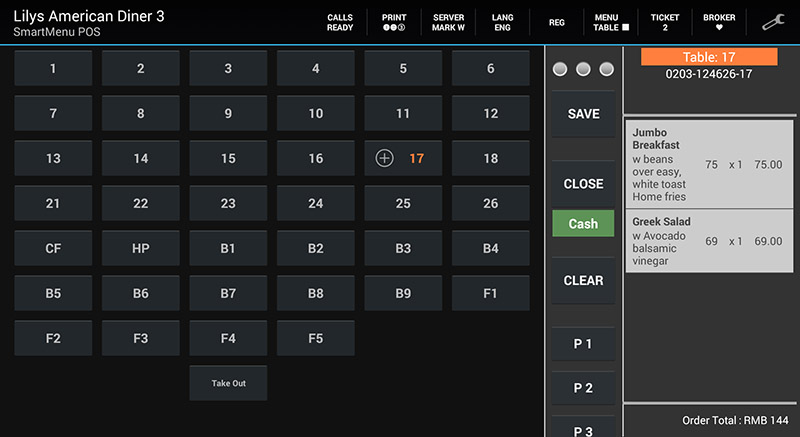

When the user clicks on the *Menu/Table* toggle button in the top panel, the left information panel will switch to the *Menu View*.

The image below shows the active *Menu View* on the left information area. It is a color-coded view of the entire menu, with each color set representing a different category of dishes. In this particular menu, for example, the red color buttons are the items which belong to the breakfast category.

  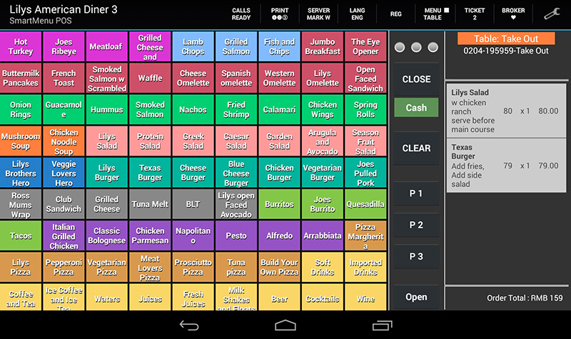

When the user pressed on one of the menu buttons, a popup window appears which allows them to configure the options of the dish and add the item to the currently selected ticket or table.

the image below shows the *Dish Options* popup for one of the items on the menu. Each *Dish Options* popup follows a color coding scheme and a structure which make it very efficient to take and manage customer orders. This approach will be discussed in detail in the **POS** App user manual document.

  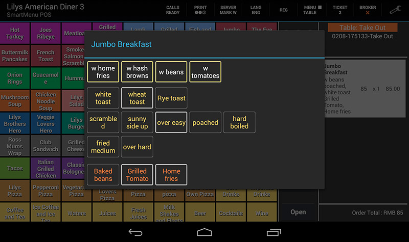

## POS App Use Case

The main use case for the SmartMenu **POS** App is:

- Full Service Restaurants with table

Unlike the QSR service model, the FSR model allows customers to open tabs and pay at the end of their experience. This allows the unique opportunity for the business to up-sell customers and can provide a much more enjoyable experience for the guests because they don't feel rushed to leave.

From a system perspective, however, this greatly increases the complexity. Many of the commercial tablet-based POS system do not support the FSR model.

The SmartMenu **POS** App enables food service businesses to fully support the FSR model.

## POS App Summary

The **POS** App is the most powerful App of the SmartMenu group because of its scalability, ease of use, and high availability design. 

You can essentially build the app to support an unlimited number of tables with unlimited number of dishes on each of the tables/tickets.

The app is designed to minimize the number of buttons the user has to press, thus allowing them to be more efficient while performing other important restaurant activities. The POS system should not hinder the staff, but rather help them to execute a higher-level customer experience. 

The **POS** app has proven to be a robust Android app that can withstand the workload of a very busy restaurant without losing tickets or data or incurring downtime.

# Quick App Overview

The **Quick** app is a ticket-based app can receive walk-in, telephone, mobile, or internet orders. The **Quick** App is very similar to the **POS** App with one key difference- rather than using tables to organize open tab, the app uses tickets to manage the order flow to the kitchen or service provider.

Key features of the **Quick** App include:

- Ticket-based app is ideal for quick service restaurant service models
- Unlimited number of tickets can be accepted
- Tickets can be accepted and closed automatically. Closed tickets generate printouts on the POS printers.
- Tickets can be manually closed by staff
- Support for SIM card based Android tablets which allow for direct telephone calls into the device
- Color coded order types
- Provides real-time response to customers placing take away orders
- Automatically collects customer critical information, including delivery address and phone number
- Allows real time interaction with customers without vocal contact. This is accomplished by using special Android tablets which can accept SIM cards enabling direct phone answering capability

## Quick App Layout

The layout of the Quick App is very similar to the POS App with one key difference. Notice in the top panel the *Menu/Tables* toggle button has been replaced with a *Menu/Tickets* button. Accordingly, the left window has replaced the *Tables View* with a *Ticket View*.

The image below shows a snapshot of the *Ticket View*. Ticket headers are color coded to show their source. In this example below, two of the ticket headers in blue indicate that these tickets were generated directly by the **Quick** App itself, while one of the ticket headers shown in purple was generated by the **Order** App.

  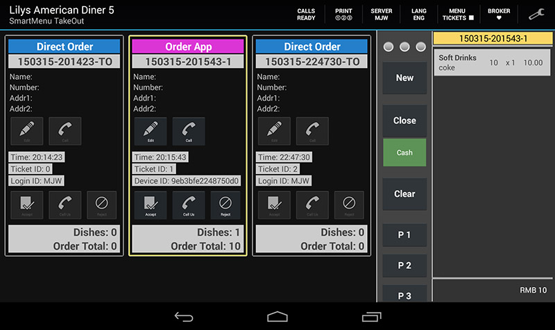

The bottom of each ticket displays the total number of dishes on the ticket and the total price of the ticket. Just as in the **POS** App, the right panel shows the details of the dishes assigned to each ticket.

## Quick Service App Use Case

Possible use cases for the SmartMenu **Quick** App include:

- Quick Service Restaurants
  The Quick App is ideal for use in QSR service models where payment is accepted at the time of order entry and payment
- Accepting Telephone Orders for Delivery
  SIM card based Android tablets can be used to streamline customer address collection and delivery
- "Line busting" configurations with the **Order** App
  The **Quick** App can be used in conjunction with the **Order** App to create a "line busting" configuration for a SQR service model.
- Accepting Remote Orders
  The **Quick** App could potentially be used to accept internet or remote orders from customers. This could potentially be extended to cover hotels or larger footprint foot and beverage service businesses.

# SmartMenu Hardware Overview

The architecture overview showed a graphical representation of the various SmartMenu hardware components.

## Android Devices

Any Android compliant device running 4.2.2 version or higher can be used to host any of the SmartMenu Android Applications. However, there are some recommended sizes to provide the best user experience.

The recommended SmartMenu device matrix:

| SmartMenu App | Recommendation                                               |
| ------------- | ------------------------------------------------------------ |
| Order         | 7 " Android Tablets. The app and dish pictures are configured to run in the portrait orientation. |
| POS           | 10" Android Tablets. The app is configured to run in landscape orientation. |
| Quick         | 10" Android Tablets. The app is configured to run in landscape orientation. to unlock full functionality, it is recommended to use tablets which support SIM cards. |
| MenuEdit      | 10" Android Tablets. The app is configured to run in landscape orientation. |

Because of the large amount of orders which can be consolidated at the POS and Quick Apps, it is recommended that these devices meet the higher end specifications in terms of RAM and storage. 

> Note:
>
> Google Play Services is NOT required to be present on any of the SmartMenu devices. This allows for a wider selection of lower cost devices to be used for SmartMenu. 

## POS Printers

POS printers must be connected by ethernet cable directly to the same network where the Wi-Fi access is provided. Printers are addressed in the system directly by IP address.

SmartMenu supports up to three (3) printers. Typically 1 printer is configured for the front counter, where customer receipts are printed, while one or two additional printers are place in the kitchen or food/beverage preparation areas.

SmartMenu supports POS printers which utilize the Epson ESC POS command set. This is the most popular POS printer communications standard. SmartMenu has been tested with the following POS printers which support ESC POS:

- Epson Printers, such as the TM44-IV

- GPrinter, a China-based lost cost maker of POS printers

SmartMenu has not been tested with Star POS printers. However, Star indicates that many of their printers have emulation mode compatible with ESC POS, so it is likely that Star POS printers can work with SmartMenu.

  

The POS printers support several different types of connectivity, but to be used with SmartMenu, they must be configured with the Ethernet connection module.

## Cash Drawers

SmartMenu supports the connection of a cash drawer to the first POS printer, which is used to print out customer receipts when a transaction is complete. For quick service restaurant (QSR) implementations, this is at the point of payment when an order is placed. For full service restaurants (FSR) this happens when an open tab is closed.

The cash drawer is connected to the POS printer by a standard 4-pin modular connector cable. This is the same as the cable used for traditional plain old telephone handsets. Once connected, the drawer is able to be opened by software control.

  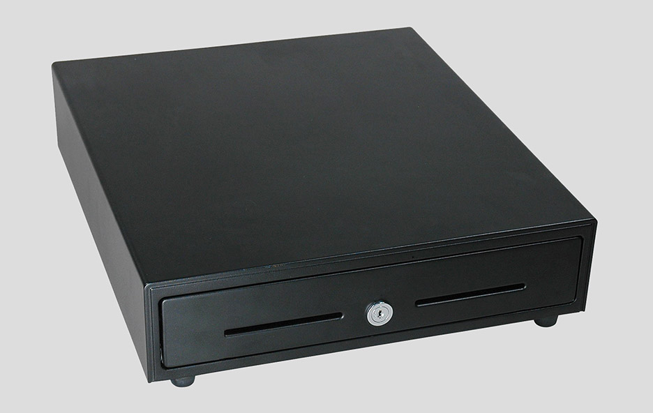

Any drawer which has the 4-pin modular connector on the back will work as a cash drawer in the SmartMenu system when connected to an Epson ESC compatible POS printer.

The cash drawer is controlled by send ESC codes to the printer to which the drawer is attached. The printers are accessed by dedicated IP address over ethernet cable.

The SmartMenu system has several user-defined settings which control how the drawer operates during transaction processing. 

## Network Requirements

SmartMenu requires a business to have working Wi-Fi. The Wi-Fi network could be a dedicated network. or a shared network for customers use.

SmartMenu requires Wi-Fi connectivity for all devices, including Ordering tablets, POS Tablet, or Quick Service tablet. Each device running a SmartMenu App need to be connected to the Wi-Fi network.

The POS printers do not use Wi-Fi (or Bluetooth) for connectivity. POS printers require wired Ethernet connectivity. The IP addresses of the POS printers must be on the same subnet as the connected SmartMenu Wi-Fi devices. Thus, the best configuration is a **Wi-Fi router** which has additional ethernet ports to support the POS printers.

Internet connection is not required for SmartMenu to operate, but is required for synchronization of data, such as menu files and order data. While offline, the system can continue to work, and all data will be synchronized when the system returns online.
